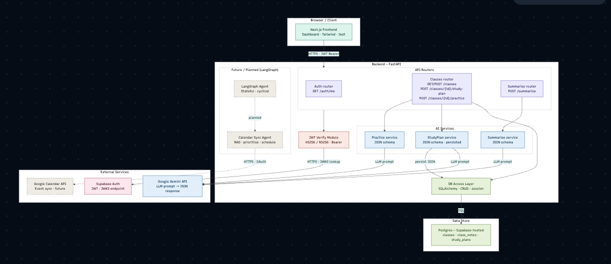
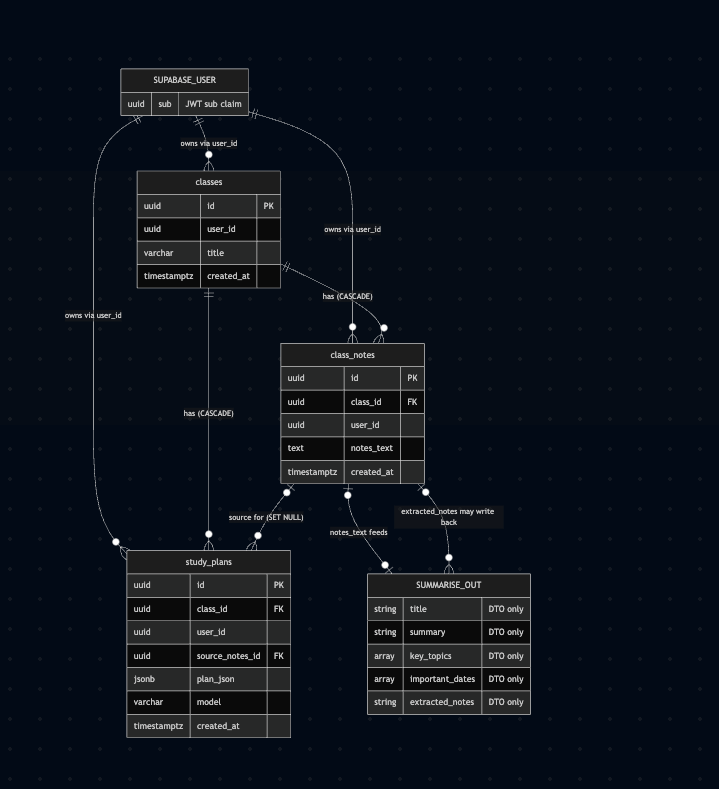
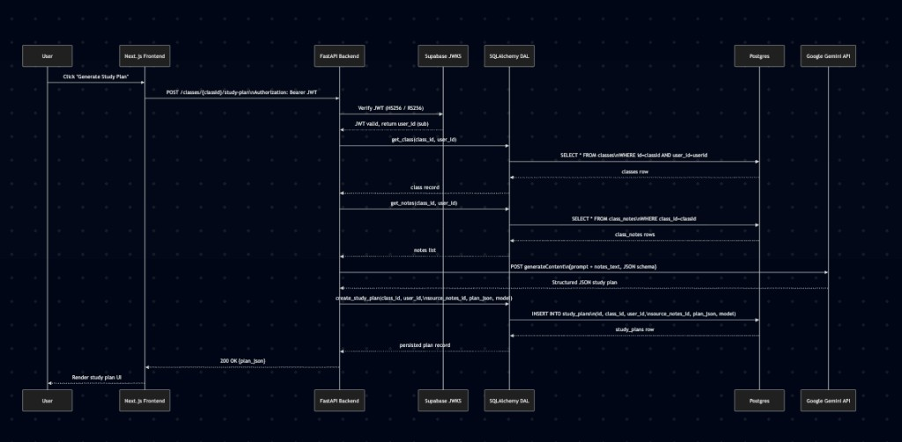

## GradePilot System Architecture

GradePilot is composed of a Next.js frontend (browser client) that calls a FastAPI backend over HTTPS using Supabase JWT bearer auth. The backend routes requests through its API routers (Auth, Classes, Summarise), verifies JWTs against Supabase (HS256 secret or JWKS for asymmetric keys), persists core data in Postgres (classes, notes, study plans) via a SQLAlchemy data access layer, and invokes Google Gemini to generate structured JSON outputs for summarisation, practice questions, and study plans. External integrations (e.g., Google Calendar sync and a LangGraph-based autonomous scheduler) are planned/optional components that would sit alongside the backend to create/update calendar events and continuously re-plan schedules based on new deadlines and user progress.

## Data Model (Core Tables)

At the data layer, GradePilots core entities are scoped per user (via the Supabase JWT sub / user id). A user owns many classes; each class can have many class_notes entries (stored note text over time) and many study_plans records (AI-generated plan JSON + model metadata). The FastAPI classes routes write/read these tables through the SQLAlchemy CRUD layer, while the AI services use class_notes as input to generate study plans (persisted to study_plans) and can optionally generate summaries from raw text for display back to the client.

Study plan Sequence Diagram

This sequence diagram shows the end-to-end Generate Study Plan flow: the Next.js client sends an authenticated request (Bearer JWT) to the FastAPI /classes/{class_id}/study-plan endpoint; the backend verifies the Supabase token (HS256 or via JWKS), loads the class and latest notes from Postgres through the SQLAlchemy data access layer, prompts Google Gemini to return a JSON study plan, persists the resulting plan into study_plans, and returns the saved plan JSON to the frontend for rendering.
